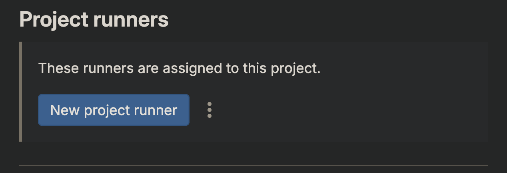

# Setting up personal GitLab runner

This document provides instructions on setting up your own personal gitlab runner

## Initiate gitlab runner

* On the project, where you need to setup GitLab runner goto Settings -> CICD -> Runners (Expand)
* Click on `New project Runner` as shown below:
    
* Give a name to the runner, and some tags, and click on `Create Runner`

## Setup runner machine

* Create a VM on OpenStack
* SSH onto the VM

### Install GitLab runner
* Download the binary for your system
   ```shell
   sudo curl -L --output /usr/local/bin/gitlab-runner https://gitlab-runner-downloads.s3.amazonaws.com/latest/binaries/gitlab-runner-linux-amd64
   ```

* Give it permission to execute
```shell
   sudo chmod +x /usr/local/bin/gitlab-runner
```

* Create a GitLab Runner user
```shell
sudo useradd --comment 'GitLab Runner' --create-home gitlab-runner --shell /bin/bash
```


* Install and run as a service
```shell
sudo gitlab-runner install --user=gitlab-runner --working-directory=/home/gitlab-runner
sudo gitlab-runner start
```

### Register runner
* From the `Register runner` page copy the code from 1st step:
```shell
gitlab-runner register  --url $GITLAB_INSTANCE_URL  --token $TOKEN
```
* While registering the runner, give the local name for your runner.
* You can choose any executor for the runner, in this case we would choose docker as the executor.

### Verify runner is running
You can manually verify that the runner is available to pick up jobs.
```shell
gitlab-runner run
```

### Install docker engine on runner
Since we used docker executor we need to setup a docker engine on the runner machine. Follwoing instructions are for installing it on ubuntu 22.04

#### Add Docker's official GPG key:
```shell
sudo apt-get update
sudo apt-get install ca-certificates curl gnupg
sudo install -m 0755 -d /etc/apt/keyrings
curl -fsSL https://download.docker.com/linux/ubuntu/gpg | sudo gpg --dearmor -o /etc/apt/keyrings/docker.gpg
sudo chmod a+r /etc/apt/keyrings/docker.gpg
```


#### Add the repository to Apt sources:
```shell
echo \
  "deb [arch=$(dpkg --print-architecture) signed-by=/etc/apt/keyrings/docker.gpg] https://download.docker.com/linux/ubuntu \
  $(. /etc/os-release && echo "$VERSION_CODENAME") stable" | \
  sudo tee /etc/apt/sources.list.d/docker.list > /dev/null
sudo apt-get update
```

#### Install the latest version of docker engine
```shell
sudo apt-get install docker-ce docker-ce-cli containerd.io docker-buildx-plugin docker-compose-plugin
```

#### Verify that docker is running
```shell
sudo docker run hello-world
```

## Verify runner is running via GitLab
* On the project, where you setup GitLab runner goto Settings -> CICD -> Runners (Expand)
* If all the steps have succeeded, then you should see a green symbol next to the runner that you created.
